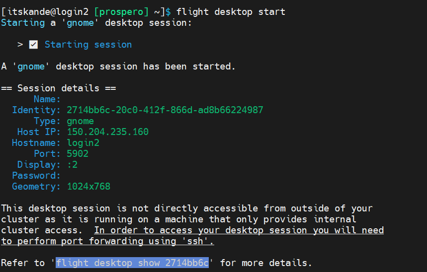
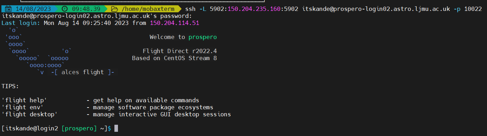

=====
Linux desktop access via VNC
=====

Here is a quick guide on how to access to the login02 via VNC

1.	Log in to Prospero-login02
2.	Run the command 

.. code-block:: console 
    flight desktop start

3.	This will generate a session and display session information such as port, password and display number.

4.	As the ports are restricted for Prospero a SSH tunnel is required to access the VNC session. This can easily be done in MobaXterm or a regular terminal in MacOSX with the following command. 

.. code-block:: console 
    
    ssh -L <Port>:150.204.235.160:<Port> <Username>@prospero-login02.astro.ljmu.ac.uk -p 10022

5.	Once logged in again with your details you can open up your choice of VNC viewer. In my example, I use TigerVNC as it has a portable executable and doesn’t require admin rights.
6.	Put in localhost:<Display>
7.	It will prompt you for a password this will be the password that is shown the image above.
